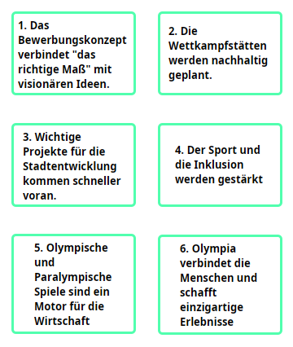

<style>
  .abstand-bottom {
    margin-bottom: 20px;
  }
  .abstand-top {
    margin-top: 15px
  }
</style>

Viele Überblicke über die Gründe für und gegen eine Bewerbung Münchens enthalten Pro- und Contra-Gesichtspunkte, deren argumentative Rolle ungeklärt bleibt:

* auf der [Webseite der Münchner Olympiabewerbung](https://www.olympiabewerbung-muenchen.com/#fuer-olympia) werden 14 vermeintliche Gründe für die Bewerbung genannt;
* [Merkur](https://www.merkur.de/lokales/muenchen/muenchen-olympija-oder-nolympia-pro-contra-buergerentscheid-olympia-in-93981355.html) hat einen Überblick über 10 Pro- und  10-Contra Gesichtspuntke veröffentlicht;
* [Radiogong](https://www.radiogong.de/olympia-bewerbung-muenchen-sommer-spiele-pro-und-kontra-olympiaparkt2025-2036-2040-2044) hat eine weitere Übersicht über Pro- und Contra-Gesichtspunkte erstellt.
* Analoge Listen lassen sich auch leicht mit sprachgenerierenden Chatbots erstellen. <!-- [Le Chat von Mistral](https://chat.mistral.ai/chat) hat beispielsweise Listen generiert, die Punkte von den oben erwähnten Listen enthalten.-->

In der Begründung des Stadtrats zum Bürgerentscheid werden folgende Gründe genannt:

```argdown-map
===
title: Liste von Gesichtspunkten für Olympia-Bewerbung (Begründung des Stadtrats zum Gegenstand des Bürgerentscheids)
color:
    colorizeByTag: true
    tagColors:
        tag-1: "#f3d942"
        pro: "#51ffae"
        contra: "#FFA44F" 
model: 
  removeTagsFromText: true
dot:
    group:
        charactersInLine: 50
    argument:
        minWidth: 0
        title:
            charactersInLine: 12
        text:
            charactersInLine: 12
    statement:
        minWidth: 0
        title:
            charactersInLine: 20
        text:
            charactersInLine: 30

webComponent:
  withoutLogo: true
selection:
    excludeDisconnected: false
===
[1. Das Bewerbungskonzept verbindet "das richtige Maß" mit visionären Ideen.] #pro

[2. Die Wettkampfstätten werden nachhaltig geplant.] #pro

[3. Wichtige Projekte für die Stadtentwicklung kommen schneller voran.] #pro

[4. Der Sport und die Inklusion werden gestärkt] #pro

[5. Olympische und Paralympische Spiele sind ein Motor für die Wirtschaft] #pro

[6. Olympia verbindet die Menschen und schafft einzigartige Erlebnisse] #pro

```
<!--
Hier ist eine andere Karte:

-->

Von diesen sechs Punkten sind die ersten zwei keine direkten Gründe für eine Bewerbung Münchens. Dass Wettkampfstätten nachhaltig gebaut werden, stellt keinen Grund dafür dar, Olympische Spiele auszurichten. Man richtet sie ja nicht aus, um Wettkampfstätten zu bauen. Dieser Punkt spielt eine andere argumentative Rolle: er soll einen möglichen Einwand gegen die Ausrichtung der Olympischen Spiele entkräften, nämlich den, dass durch die Ausrichtung die Umwelt geschädigt oder Ressourcen verschwendet würden. 

Wie kann man nun angesichts dieser Vielzahl von vermeintlichen Pro- und Contra-Gründen zu einer reflektierten Entscheidung gelangen, ob die Bewerbung Münchens unterstützt werden soll oder nicht?

<p class="abstand-bottom">

  ## Schritt 1: Sortierung der vorgebrachten Punkte in Pro- und Contra-Gründe

  </p>

  Zunächst müssen die in den Überblickslisten vorgebrachten Gesichtspunkte sortiert werden. Das Kriterium für die Sortierung lautet: die dialektische Rolle der vorgebrachten Gesichtspunkte. Der Zweck dieses Sortierens liegt darin, beitragende Gründe für und gegen eine Olympia-Bewerbung Münchens zu identifizieren. 
  
  Einige der vorgebrachten Gesichtspunkte stellen sich beispielsiwese als unterstützende Gründe für die beitragenden Gründe heraus, andere als Einwände gegen die Behauptungen der Gegenseite, einige auch als rhetorische Mittel (d.h. Behauptungen, denen keine argumentative Rolle zukommt).<sup><a href="#footnote1" id="footnote-ref1">1</a></sup> 

Die nachfolgende Graphik bildet das Ergebnis meiner Identifikation von **Gründen für eine Bewerbung** Münchens ab:

```argdown-map
===
title: Olympia-Bewerbung München 2025 -- Pro-Gründe
color:
    colorizeByTag: true
    tagColors:
        tag-1: "#f3d942"
        pro: "#51ffae"
        contra: "#FFA44F" 
model: 
  removeTagsFromText: true
dot:
    group:
        charactersInLine: 100
    argument:
        minWidth: 0
        title:
            charactersInLine: 30
        text:
            charactersInLine: 40
    statement:
        minWidth: 0
        title:
            charactersInLine: 30
        text:
            charactersInLine: 40
webComponent:
  withoutLogo: true
selection:
    excludeDisconnected: false
===

# Vorgebrachte Gründe für eine Bewerbung: Positive Konsequenzen für die Stadt und ihre Bewohner\*innen

## Realisierung wichtiger Stadtentwicklungsprojekte 

[1. Neuer Wohnraum]: Bei einem Zuschlag für die Austragung von Olympischen Spielen in München wird zusätzlicher Wohnraum in München geschaffen, der ohne die Austragung der Spiele nicht oder nur viel später geschaffen werden würde: 4000 Wohnungen im neuen Olympischen Dorf. #pro
  <+ <Finanzielle Zuschüsse vom Bund und Land>: Durch eine Olympia-Bewerbung werden zusätzliche Finanzmittel fließen, die sonst nicht verfügbar wären. Diese Gelder sollen die Stadtentwicklung beschleunigen und die Kommunalfinanzen entlasten. #pro {rank: "r2"}

[2. Verbesserung der städtischen Mobilität]: Bei einem Zuschlag für die Austragung von Olympischen Spielen in München werden zahlreiche Mobilitätsprojekte realisiert, die sonst nicht oder viel später realisiert werden würden: Ausbau des öffentlichen Nahverkehrs (Ausbau U4, U9, S-Bahn-Ringschluss Nord), Radschnellwege, Mobility Hubs. #(pro)
  <+ <Finanzielle Zuschüsse vom Bund und Land> #pro

[3. Sanierung von Sportstätten]: Bei einem Zuschlag für die Austragung von Olympischen Spielen in München werden Sport- und Freizeitstätten saniert und ausgebaut, die von der Öffentlichkeit genutzt werden können. #(pro)
  <+ <Finanzielle Zuschüsse vom Bund und Land> #pro

[4. Ausbau einer barierefreien Stadt]: Bei einem Zuschlag für die Austragung von Olympischen Spielen in München wird die Barrierefreiheit in der Stadt konsequent umgesetzt. #(pro)
  <+ <Finanzielle Zuschüsse vom Bund und Land> #pro

[5. Realisierung von Renaturierungs- und Klimaanpassungsmaßnahmen]: Bei einem Zuschlag für die Austragung von Olympischen Spielen in München werden Renaturierungs- und Klimaanpassungsmaßnahmen umgesetzt, die sonst nicht in der Frist realisiert werden würden. #(pro)
  <+ <Finanzielle Zuschüsse vom Bund und Land> #pro


## Weitere positive Konsequenzen von Olympischen Spielen in der Stadt 

[6. Stärkung lokaler Wirtschaft]: Von der Ausrichtung von Olympischen Spielen in München profitieren lokale Unternehmen durch zusätzlich erzeugte Nachfrage. #(pro)
  

[7. Unterstützung Breitensports]: Breitensport erhält durch die Ausrichtung der Olympischen Spiele größeren Zulauf als ohne ihre Ausrichtung. #(pro)
  <+ <Ausbau der Infrastruktur in Kombination mit öffentlicher Aufmerksamkeit für Sport>: durch den Ausbau der Sport- und Freizeit-Infrastruktur wird ermöglicht, dass mehr Menschen an Sportaktivitäten teilhaben und durch die öffentliche Aufmerksamkeit für Olympische Spiele werden auch mehr Menschen zu sportlichen Aktivitäten motiviert. #(pro) {rank: "r2"}

[8. Stärkung Gesellschafltichen Zusammenhalts]: Die Ausrichtung von Olympischen Spielen in München "schafft einen Schulterschluss in der Gesellschaft und erzeugt ein Miteinander". #(pro)
  
[9. Einzigartige Erlebnisse für Stadtbewohner*innen]: Ausrichtung von Olympischen Spielen in München schafft einzigartige emotionale Erlebnisse in der Stadt. #(pro)

```
Die grün umrandeten Kästchen repräsentieren jeweils einen beitragenden Grund für die Bewerbung. Sie habe ich in zwei Gruppen unterteilt:
* Eine erfolgreiche Olympia-Bewerbung Münchens trägt zur Realisierung von wichtigen Stadtentwicklungsprojekten bei;
* Eine erfolgreiche Olympia-Bewerbung Münchens bringt weitere positive Konsequenzen für die Stadt und ihre Bewoher\*innen.

Die grün ausgefüllten Kästchen repräsentieren zwei Argumente, die für einzelne beitragende Gründe vorgebracht werden. 

Die nachfolgende Graphik bildet die vorgebrachten **Gründe gegen eine Bewerbung** ab:

```argdown-map
===
title: Olympia-Bewerbung München 2025 -- Contra-Gründe
color:
    colorizeByTag: true
    tagColors:
        tag-1: "#f3d942"
        pro: "#51ffae"
        contra: "#FFA44F" 
model: 
  removeTagsFromText: true
dot:
    group:
        charactersInLine: 100
    argument:
        minWidth: 0
        title:
            charactersInLine: 30
        text:
            charactersInLine: 40
    statement:
        minWidth: 0
        title:
            charactersInLine: 30
        text:
            charactersInLine: 40
webComponent:
  withoutLogo: true
selection:
    excludeDisconnected: false
===

# Vorgebrachte Gründe gegen eine Bewerbung Münchens um Olympia-Austragung

## Kosten und Finanzrisiken

[Hohe Kosten für temporäre Olympia-Infrastruktur]: Obwohl München über viele Sportstätten verfügt, werden für die Olympia-Ausrichtung bestehende Sportstätten auf Olympia-Niveau ausgebaut werden müssen. Trotz der finanziellen Zuschüsse wird dieser Ausbau den Stadthaushalt stark belasten und wichtigere Projekte aufschieben. #(contra)

[Finanzrisiken]: Es besteht die Gefahr, dass die tatsächlichen Kosten für die Durchführung der Olympischen Spiele höher ausfallen werden als geschätzt und dass sie von der Stadt München getragen werden müssen. #contra

## Langfristige negative Auswirkungen

[Eingriffe in die schützenswerte Natur und Umwelt]: Für die Spiele könnten wertvolle Naturflächen zerstört oder beeinträchtigt werden, beispielsweise Versiegelung des Ackerbodens in Daglfing für das Olympische Dorf. #contra

[Negative soziale Folgen]: Gentrifizierung, Gefahr, dass die geplanten Wohnungen teuer vermietet werden. #contra


## Das IOC kein fairer Partner

[Risiko einer "Geiselnahme" durch das IOC]: Städte, die Olympische Spiele ausrichten, müssen Verträge unterzeichnen, die dem IOC umfassende Rechte einräumen -- etwa bei der Nutzung öffentlicher Flächen, der Werbung oder der Sicherheit. Diese Verträge können die Stadt daran hindern, die Spiele so auszurichten, wie sie sie ursprünglich geplant haben. #contra

```

Die vorgebrachten Einwände gegen die Olympia-Bewerbung Münchens lassen sich in drei Gruppen unterteilen:
* Durchführung der Olympischen Spiele wird zu negativen sozialen und ökologischen Konsequenzen in München führen:
* Durchführung der Olympischen Spiele ist mit hohen Kosten und Finanzrisiken für den Stadthaushalt verbunden;
* Durchführung der Olympischen Spiele erfordert Kooperation mit einem unfairen Partner, dem Internationalen Olympischen Komitee. 

<p class="abstand-bottom">

  ## Schritt 2: Faktencheck
</p>

Die identifizierten Gründe für und gegen die Bewerbung unterstellen zahlreiche empirische Behauptungen, meist von der Form: 
* Ausrichtung der Olympischen Spiele wird zu denen und jenen Konsequenzen führen (und diese Konsequenzen sind positiv/negativ für die Stadt).

Die Plausibilität der Gründe hängt entscheidend von der Plausibilität dessen ab, ob die darin behaupteten Konsequenzen tatsächlich eintreten werden. 

Vorhersagen von langfristigen sozial-ökonomischen Konsequenzen von politischen Maßnahmen sind meist sehr unsicher bzw. schwer zu belegen. Dies gilt auch in Bezug auf viele der diskutierten Konsequenzen der Olympischen Spiele:

* Auswirkungen auf den Breitensport: Es gibt eine [Studie](https://api.unil.ch/iris/server/api/core/bitstreams/7f0f0803-9b33-4fa1-ab9f-b0d7abaa6a44/content), die untersucht hat, ob es Evidenzen dafür gibt, dass die Durchführung von Olympischen Spielen die Teilnahme am Breitensport gestärkt hätte. Aus der Untersuchung von Daten zu drei Spielen hat sie keine Belege dafür gefunden. Das zeigt allerdings nicht, dass es keinen Effekt von Olympischen Spielen auf den Breitensport gäbe (da die bisherigen Erhebungen nicht umfassend genug waren). Dies zeigt lediglich, dass wir wenig über diesen Effekt wissen: möglicherweise besteht er, möglicherweise besteht er nicht. 

* Soziale Auswirkungen: Analoges gilt für die Behauptung der Gegner\*innen der Olympischen Spiele, letztere würden Gentrifizierungseffekte verursachen. Auch hierzu findet sich kaum robuste Evidenz. Dies kann aber daran liegen, dass dieser Effekt nicht gründlich genug gemessen wurde (und dass er schwer zu messen ist aufgrund von sehr vielen möglichen Einflussfaktoren auf beispielsweise Mieten in einer Großstadt).

* Invesititonskosten und Finanzrisiken: hierzu hat eine [Studie](https://www.olympiabewerbung-muenchen.com/app/uploads/2025/10/MCube_Olympia_Studie.pdf) im Auftrag der Stadt München eine Prognose mit mehreren Szenarien ersellt. In einem [Artikel in der Süddeutschen Zeitung](https://www.sueddeutsche.de/projekte/artikel/politik/olympia-bewerbung-faktencheck-pro-contra-e104509/) gibt es einen Überblick über Kostenschätzungen und Kosten der vergangenen Spiele. Diese Überblicke verdeutlichen, dass auch die Abschätzung von Kosten sowie von erwarteten Gewinnen für die lokale Wirtschaft mit vielen Unsicherheiten behaftet ist.

Unabhängig davon bleiben Gründe, deren behauptete Konsequenzen unbestreitbar sind:
* Durchführung von Olympischen Spielen wird die Realisierung von städtischen Infrastrukturprojekten beschleunigen und sie für die Stadt kostengünstiger machen; Olympische Spiele werden emotionale Erlebnisse liefern, möglicherweise gesellschaftlichen Zusammenhalt stärken und Breitensport populärer machen.  
* Durchführung von Olympischen Spielen wird zusätzliche Investitionen durch die Stadt München erfordern. Es ist möglich, dass die Ausrichter auf einem höheren Teil der Kosten sitzen bleiben als ursprünglich geplant. Es ist möglich, dass das IOC der Stadt unerwünschte Bedingungen für die Durchführung der Spiele diktiert.

Die nachfolgende Graphik repräsentiert die nun entstandene Dialektik: Es gibt beitragende Gründe, die für die Durchführung der Spiele sprechen (grün umrandete Kästchen in der untersten Reihe), und Gründe dagegen (orange umrandet in der untersten Reihe). Wie sehen nun Argumente aus, die im Lichte dieser beitragenden Pro- und Contra-Gründe die Entscheidung für und gegen die Olympia-Bewerbung Münchens rechtfertigen? -- in der Graphik sind sie als Fragezeichen symbolisiert (orange bzw. grün ausgefüllte Kästchen). 

```argdown-map
===
title: Dialektische Struktur der Kontroverse um Olympia-Bewerbung Münchens -- die fehlenden Argumente
color:
    colorizeByTag: true
    tagColors:
        tag-1: "#f3d942"
        pro: "#51ffae"
        contra: "#FFA44F" 
model: 
  removeTagsFromText: true
dot:
    group:
        charactersInLine: 100
    argument:
        minWidth: 0
        title:
            charactersInLine: 30
        text:
            charactersInLine: 40
    statement:
        minWidth: 0
        title:
            charactersInLine: 30
        text:
            charactersInLine: 40
webComponent:
  withoutLogo: true
selection:
    excludeDisconnected: false
===

# Argumentstruktur für und gegen Olympia-Bewerbung


[Pro-Olympia-Bewerbung]: Die Stadt München sollte sich um die Ausrichtung der Olympischen Spiele 2036, 40, 44 bewerben. #(pro)
 <+ <Pro-Argument>

[Gegen-Olympia-Bewerbung]: Die Stadt München sollte sich nicht um die Ausrichtung der Olympischen Spiele 2036/40/44 bewerben. #(contra)
 <+ <Contra-Argument>

<Pro-Argument>: ? #pro
 <+ [Realisierung wichtiger Stadtentwicklungsprojekte]: Bei einem Zuschlag für die Austragung von Olympischen Spielen in München werden zahlreiche Stadtentwicklungsprojekte realisiert: Wohnungsbau, Mobilitätsinfrastruktur, Sanierung von Sportstätten, Ausbau der Barrierefreiheit in der Stadt, Renaturierungs- und Klimaanpassungsmaßnahmen. #pro
 <+ [Weitere Positive Konsequenzen für die Stadt]: Von der Ausrichtung der Olympischen Spiele in München profitiert möglicherweise die lokale Wirtschaft, der Breitensport könnte größeren Zulauf erhalten, gesellschaftlicher Zusammenhalt würde gestärkt und einzigartige emotionale Erlebnisse werden geboten. #pro.


<Contra-Argument>: ? #(contra)
 <+ [Hohe Kosten und Finanzrisiken]: Der Ausbaue von Sportstätten auf Olympia-Niveau wird den Stadthaushalt stark belasten und wichtigere Projekte aufschieben. Es besteht die Gefahr, dass die tatsächlichen Kosten für die Durchführung der Olympischen Spiele höher ausfallen werden als geschätzt und dass sie von der Stadt München getragen werden müssen. #(contra)
 <+ [Risiko einer "Geiselnahme" durch das IOC]: Städte, die Olympische Spiele ausrichten, müssen Verträge unterzeichnen, die dem IOC umfassende Rechte einräumen -- etwa bei der Nutzung öffentlicher Flächen, der Werbung oder der Sicherheit. Diese Verträge können die Stadt daran hindern, die Spiele so auszurichten, wie sie sie ursprünglich geplant haben. #contra

```

<p class="abstand-bottom">

  ## Schritt 3: Rekonstruktion der Grundargumente
</p>

Die nachfolgende Graphik bildet die dialektische Struktur der von mir ergänzten Argumente für ("Pro-Argument für Olympia") und gegen ("Contra-Argument gegen Olympia-Bewerbung") eine Olympia-Bewerbung im Lichte der vorgebrachten Vor- und Nachteile ab. 

```argdown-map
===
title: Struktur der Argumente für und gegen eine Olympia-Bewerbung
color:
    colorizeByTag: true
    tagColors:
        tag-1: "#f3d942"
        pro: "#51ffae"
        contra: "#FFA44F" 
model: 
  removeTagsFromText: true
dot:
    group:
        charactersInLine: 100
    argument:
        minWidth: 0
        title:
            charactersInLine: 30
        text:
            charactersInLine: 40
    statement:
        minWidth: 0
        title:
            charactersInLine: 30
        text:
            charactersInLine: 45
webComponent:
  withoutLogo: true
selection:
    excludeDisconnected: true
===

# Argumentstruktur für und gegen Olympia-Bewerbung

## Grundthesen und -argumente

[Pro-Olympia-Bewerbung]: Die Stadt München sollte sich um die Ausrichtung der Olympischen Spiele 2036, 40, 44 bewerben. #(pro)
 <+ <Pro-Argument für Olympia>

[Gegen-Olympia-Bewerbung]: Die Stadt München sollte sich nicht um die Ausrichtung der Olympischen Spiele 2036/40/44 bewerben. #(contra)
 <+ <Contra-Argument gegen Olympia-Bewerbung>

<Pro-Argument für Olympia>: Ausrichtung von Olympischen Spielen in München bringt deutlich mehr positive Konsequenzen für die Stadt als Nachteile daraus zu befürchten wären. #pro

(1) [Positive Konsequenzen aus Olympia]
(2) [Negative Befürchtungen aus Olympia]
(3) [Prinzip zur Abwägung zwischen Vor-und Nachteilen]
(4) [Abwägung Pro-Olympia]
(5) [Optimalität der Olympia-Bewerbung]
----
(6) München soll Olympische Spiele durchführen. 

<Contra-Argument gegen Olympia-Bewerbung>: Die erwarteten positiven Konsequenzen für München aus der Ausrichtung von Olympischen Spielen rechtfertigen nicht das Risiko, die erwarteten Nachteile aus ihrer Ausrichtung. #(contra)

(1) [Positive Konsequenzen aus Olympia]
(2) [Negative Befürchtungen aus Olympia]
(2) [Prinzip zur Abwägung zwischen Vor-und Nachteilen]
(3) [Abwägung Contra-Olympia]
(4) [Bessere Alternativen zu Olympia-Ausrichtung]
----
(5) München soll die Olympische Spiele nicht durchführen. 


## Unkontroverse Prämissen

[Positive Konsequenzen aus Olympia]: Wenn die Stadt München Olympische Spiele 2036/40/44 ausrichtet, wird dies zahlreiche wünschenswerte Konsequenzen mit sich bringen: Ausbau der städtischen Infrastruktur, Gewinne für die lokale Wirtschaft, Stärkung des Breitensports, Stärkung gesellschaftlichen Zusammenhalts sowie einzigartie Erlebnisse. #tag-1

[Negative Befürchtungen aus Olympia]: Wenn die Stadt München den Zuschlag für die Ausrichtung Olympischer Spiele 2036/40/44 erhält, muss sie hohe Investitionen in die Stadtinfrastruktur stemmen, die andere erforderliche Ausgaben verdrängen können, sie läuft Gefahr, höhere Kosten tragen zu müssen als geplant, und sie kann vom Internationalen Olympischen Kommitee dazu vertraglich gebunden werden, Maßnahmen umzusetzen, die die Stadt für nicht erstrebenswert hält. #tag-1

[Prinzip zur Abwägung zwischen Vor-und Nachteilen]: Wenn eine Maßnahme M-OS zu erstrebenswerten Konsequenzen (K-1,...,K-n) führt und von der Maßnahme Nachteile zu erwarten sind (N-1,...,N-m), soll die Maßnahme M-OS genau dann durchgeführt werden, wenn gilt: (i) die erwarteten Vorteile aus den erwünschten Konsequenzen (K-1,...,K-n) überwiegen insgesamt die erwartente Nachteile (N-1,...,N-m) und (ii) es gibt keine anderen Weg, die Vorteile aus den erstrebenswerten Konsequenzen (K-1,...,K-n) mit geringeren Nachteilen als (N-1,...,N-m) zu erreichen. #(tag-1)

## Kontroverse Prämissen

[Abwägung Pro-Olympia]: Angesichts der benötigten Investitionen für die Ausrichtung der Olympischen Spiele, der damit verbundenen Finanzrisiken und der Risiken der Einflussnahme durch das IOC bringen die kurzfristigen finanziellen Gewinne für die lokale Wirtschaft und die mittel- bis langfristigen Vorteile der Ausbau der städtischen Infrastruktur und der städtischen Lebensqualität insgesamt viel höhere Vorteile für die Stadt. #(pro)

[Optimalität der Olympia-Bewerbung]: Es gibt keinen anderen Weg, mit geringeren Nachteilen als durch eine erfolgreiche Olympia-Bewerbung die positiven Konsequenzen der Olympia-Bewerbung für die Stadt zu realisieren.#(pro)

[Abwägung Contra-Olympia]: 
Es ist nicht feststellbar, ob die erwarteten postivien Konsequenzen aus einer Ausrichtung von Olympischen Spielen in München die erwarteten Nachteile überwiegen. #(contra)

[Bessere Alternativen zu Olympia-Ausrichtung]: Es gibt andere Wege, mit geringeren Nachteilen als durch eine erfolgreiche Olympia-Bewerbung die positiven Konsequenzen der Olympia-Bewerbung für die Stadt zu realisieren. #(contra)

```

Beide Argumente bestehen aus jeweils fünf Prämissen. (Alle Prämissen der rekonstruierten Argumente können durch einen Klick auf das "Source"-Symbol in der Graphik angezeigt werden.)

Die ersten drei Prämissen sind unter den Befürworter\*innen und den Gegner\*innen der Olympia-Bewerbung unumstritten (sie sind in der Graphik entsprechend gruppiert): 
* die erste Prämisse beinhaltet die angeführten Vorteile für die Stadt aus der Durchführung Olympischer Spiele;
* die zweite Prämisse beinhaltet die angeführten Nachteile für die Stadt aus der Durchführung der Spiele;
* die dritte Prämisse (**Prinzip zur Abwägung zwischen Vor-und Nachteilen**) macht ein generelles Schlussfolgerungsprinzip explizit, das erlaubt, im Lichte von Vor- und Nachteilen einer Maßnahme darauf zu schlussfolgern, dass die Maßnahme realisiert werden soll. Sie macht zwei Bedingungen explizit, die erfüllt sein müssen, damit die Handlungsempfehlung folgt, dass die Maßnahme realisiert werden sollte:
  (i) die erwarteten Vorteile aus der Realisierung der Maßnahme überwiegen insgesamt die erwarteten Nachteile aus ihrer Realisierung;
  (ii) es gibt keinen alternativen Weg außer der in Frage stehenden Maßnahme, um die erwarteten Vorteile mit geringeren erwarteten Nachteilen zu realisieren.

Die Kontroverse in der Beurteilung der Erwünschtheit der Olympischen Spiele resultiert gerade aus der Beurteilung, ob die beiden Bedingungen im formalen Schlussprinzip erfüllt sind. Die letzten beiden Prämissen im Argument machen diese Beurteilungen explizit:

* die **Befürworter\*innen der Bewerbung** sind auf die Thesen festgelegt, dass beide Bedingungen erfüllt sind, dass also 
  * die erwarteten Vorteile aus der Durchführung Olympischer Spiele die Risiken überwiegen (Prämisse 4 **Abwägung Pro-Olympia** im Pro-Argument);
  * es keinen anderen Weg gibt, all die Vorteile für die Stadt zu realisieren, ohne die Risiken in Kauf zu nehmen (Prämisse 5 **Optimalität der Olympia-Bewerbung** im Pro-Argument).

<p class="abstand-top">

* die **Gegner\*innen der Bewerbung** sind darauf festgelegt, dass mindestens eine der beiden Bedingungen nicht erfüllt ist:</p>
  * entweder dass die Risiken aus der Durchführung der Olympischen Spiele die erwarteten Vorteile für die Stadt überwiegen (Prämisse 4 **Abwägung Contra-Olympia** im Contra-Argument) 
  * oder dass es andere Wege gibt, die Vorteile, die die Stadt aus der Olympia-Bewerbung und -Durchführung hätte, mit geringeren Risiken zu realisieren (Prämisse 5 **Bessere Alternativen zu Olympia-Ausrichtung** im Contra-Argument). 

<p class="abstand-top">

### Zwischenfazit
</p>

Bereits diese Argumentrekonstruktion verdeutlicht Folgendes:

* weder für die Befürworter\*innen noch für die Gegner\*innen der Olympischen Spiele reicht es aus, einzelne positive bzw. negative Gründe anzuführen. Vielmehr muss eine Abwägung der beitragenden Gründe begründet erfolgen.
* allein die Abwägung reicht auch für eine reflektierte Entscheidung nicht aus. Die Befürworter\*innen sind darauf festgelegt, dass es keine Alternative gibt, um die anvisierten positiven Konsequenzen der Olympischen Spiele mit geringeren Nachteilen realisiert werden können. Die Gegner\*innen können hingegen ihre Ablehnung damit begründen, dass sie eine solche Alternative aufzeigen. 

Wenden wir uns nun auch diesen Argumenten zu. 

<p class="abstand-bottom">

  ## Schritt 4: Abwägungsargumente
</p>

Die nachfolgende Graphik bildet Argumente ab, mit denen die vier kontroversen Behauptungen begründet werden können. Die rekonstruierten Argumente sind Interpretationen, die mir als die stärksten Argumente für die jeweiligen Thesen erscheinen. Darüber, welche Argumente am stärksten sind, herrscht üblicherweise keine Einigkeit. Vielleicht sehen andere Leser\*innen andere Argumente für eine der kontroversen Thesen, die sie für überzeugender halten. 
Doch bereits die von mir skizzierten Argumentationen verdeutlichen Punkte, deren Klärung für eine reflektierte Positionierung in dieser Debatte erforderlich ist. 
Betrachten wir zunächst die Argumentskizzen.

```argdown-map
===
title: Rekonstruktion der Argumente für die kontroversen Prämissen
color:
    colorizeByTag: true
    tagColors:
        tag-1: "#f3d942"
        pro: "#51ffae"
        contra: "#FFA44F" 
model: 
  removeTagsFromText: true

webComponent:
  withoutLogo: true
selection:
    excludeDisconnected: true
===

[Pro-Olympia-Bewerbung]: Die Stadt München sollte sich um die Ausrichtung der Olympischen Spiele 2036, 40, 44 bewerben. #(pro)
 <+ <Pro-Argument für Olympia>

[Gegen-Olympia-Bewerbung]: Die Stadt München sollte sich nicht um die Ausrichtung der Olympischen Spiele 2036/40/44 bewerben. #(contra)
 <+ <Contra-Argument gegen Olympia-Bewerbung>

<Pro-Argument für Olympia>: Ausrichtung von Olympischen Spielen in München bringt deutlich mehr positive Konsequenzen für die Stadt als Nachteile daraus zu befürchten wären. #pro

(1) Positive Konsequenzen aus Olympia
(2) Negative Befürchtungen aus Olympia
(3) Prinzip zur Abwägung zwischen Vor-und Nachteilen
(4) [Abwägung Pro-Olympia]
(5) [Optimalität der Olympia-Bewerbung]
----
(6) München soll Olympische Spiele durchführen. 

<Contra-Argument gegen Olympia-Bewerbung>: Die erwarteten positiven Konsequenzen für München aus der Ausrichtung von Olympischen Spielen rechtfertigen nicht das Risiko, die erwarteten Nachteile aus ihrer Ausrichtung in Kauf zu nehmen. #(contra)

(1) Positive Konsequenzen aus Olympia
(2) Negative Befürchtungen aus Olympia
(3) Prinzip zur Abwägung zwischen Vor-und Nachteilen
(4) [Abwägung Contra-Olympia]
(5) [Bessere Alternativen zu Olympia-Ausrichtung]
----
(6) München soll die Olympische Spiele nicht durchführen. 

## Unkontroverse Prämissen

[Positive Konsequenzen aus Olympia]: Wenn die Stadt München Olympische Spiele 2036/40/44 ausrichtet, wird dies zahlreiche wünschenswerte Konsequenzen mit sich bringen: Ausbau der städtischen Infrastruktur, Gewinne für die lokale Wirtschaft, Stärkung des Breitensports, Stärkung gesellschaftlichen Zusammenhalts sowie einzigartie Erlebnisse. #tag-1

[Negative Befürchtungen aus Olympia]: Wenn die Stadt München den Zuschlag für die Ausrichtung Olympischer Spiele 2036/40/44 erhält, muss sie hohe Investitionen in die Stadtinfrastruktur stemmen, die andere erforderliche Ausgaben verdrängen können, sie läuft Gefahr, höhere Kosten tragen zu müssen als geplant, und sie kann vom Internationalen Olympischen Kommitee dazu vertraglich gebunden werden, Maßnahmen umzusetzen, die die Stadt für nicht erstrebenswert hält. #tag-1

[Prinzip zur Abwägung zwischen Vor-und Nachteilen]: Wenn eine Maßnahme M-OS zu erstrebenswerten Konsequenzen (K-1,...,K-n) führt und von der Maßnahme Nachteile zu erwarten sind (N-1,...,N-m), soll die Maßnahme M-OS genau dann durchgeführt werden, wenn gilt: (i) die erwarteten Vorteile aus den erwünschten Konsequenzen (K-1,...,K-n) überwiegen insgesamt die erwartente Nachteile (N-1,...,N-m) und (ii) es gibt keine anderen Weg, die Vorteile aus den erstrebenswerten Konsequenzen (K-1,...,K-n) mit geringeren Nachteilen als (N-1,...,N-m) zu erreichen. #(tag-1)

## Kontroverse Prämissen

[Abwägung Pro-Olympia]: Angesichts der benötigten Investitionen für die Ausrichtung der Olympischen Spiele, der damit verbundenen Finanzrisiken und der Risiken der Einflussnahme durch das IOC bringen die kurzfristigen finanziellen Gewinne für die lokale Wirtschaft und die mittel- bis langfristigen Vorteile der Ausbau der städtischen Infrastruktur und der städtischen Lebensqualität insgesamt viel höhere Vorteile für die Stadt. #(pro)

[Optimalität der Olympia-Bewerbung]: Es gibt keinen anderen Weg, mit geringeren Nachteilen als durch eine erfolgreiche Olympia-Bewerbung die positiven Konsequenzen der Olympia-Bewerbung für die Stadt zu realisieren.#(pro)

[Abwägung Contra-Olympia]: 
Es ist nicht feststellbar, ob die erwarteten postivien Konsequenzen aus einer Ausrichtung von Olympischen Spielen in München die erwarteten Nachteile überwiegen. #(contra)

[Bessere Alternativen zu Olympia-Ausrichtung]: Es gibt andere Wege, mit geringeren Nachteilen als durch eine erfolgreiche Olympia-Bewerbung die positiven Konsequenzen der Olympia-Bewerbung für die Stadt zu realisieren. #(contra)

## Pro-Argumente

<Bestreiten der Nachteile aus Olympia-Durchführung>: es gibt keine ernst zu nehmenden Nachteile für die Stadt München aus der Durchführung der Olympischen Spiele


<Positive Erfahrungen von Paris und London>: die Durchführung der Olympischen Spiele in Paris und London haben gezeigt, dass die Spiele keine Finanzlücken in Stadthaushalten gerissen haben und dass die Spiele die städtische Entwicklung vorangetrieben haben.#(pro)
 +> [Abwägung Pro-Olympia] 

<Zuschüsse von Bund und Land für die Ausrichtung der Spiele>: Durch die Zuschüsse von Bund und Land im Falle des Zuschlages für die Ausrichtung der Spiele werden die städtischen Infrastrukturprojekte viel günstiger für die Stadt sein als wenn sie die Infrastrukturprojekte selbst realisiert.#(pro)
 +> [Optimalität der Olympia-Bewerbung]

 <Positive Erfahrungen von Paris und London>

 (1) Die Durchführung der Olympischen Spiele in Paris und London hat gezeigt, dass die Spiele keine unvorhergesehenen Finanzlücken in Stadthaushalten gerissen haben und dass die Spiele die städtische Entwicklung vorangetrieben haben.
 (2) Die Städte Paris, London und München sind sich in allen relevanten Hinsichten ähnlich, die für die Organisation und Durchführung von Olympischen Spielen einschlägig sind. 
 (3) Bei der Abschätzung von unsicheren Kosten einer Maßnahme ist es vernünftig, Erfahrungswerte von Akteuren zugrunde zu legen, welche in allen relevanten Hinsichten in Bezug auf die Organisation und Durchführung der Maßnahme ähnlich sind. 
 ----
 (4) Es ist vernünftig davon auszugehen, dass die Durchführung der Olympischen Spiele in München keine unvorhergesehenen Finanzlücken in Stadthaushalten gerissen hat un dass sie die städtische Entwicklung vorantreiben. 

 <Zuschüsse von Bund und Land für die Ausrichtung der Spiele>

 (1) Durch die Zuschüsse von Bund und Land im Falle des Zuschlages für die Ausrichtung der Spiele werden die städtischen Infrastrukturprojekte viel günstiger für die Stadt sein als wenn sie die Infrastrukturprojekte selbst realisiert.
 (2) Es gibt keinen anderen Weg, um finanzielle Zuschüsse für die städtischen Infrastrukturprojekte in mindestens gleicher Höhe zu erhalten, als durch die Verpflichtung zur Durchführung der Olympischen Spiele.
 ----
 (3) Die Ausrichtung der Olympischen Spiele ist der optimale Weg, um die städtischen Infrastrukturprojekte zu realisieren. 

## Contra-Argumente

<Risiken aus der möglichen Einflussnahme durch das IOC unkalkulierbar>: Das IOC hat die Verhandlungsmacht, den ausrichtenden Städten Bedingungen zu diktiren, die die ursprünglich geplanten Vorteile nicht realisieren lassen. Da es nicht abschätzbar ist, wie wahrscheinlich es ist, sind die erwarteten Vorteile nicht kalkulierbar. #(contra)
 +> [Abwägung Contra-Olympia]

 <Alternative: Stadtentwicklung selbst in die Hand zu nehmen>: Es ist besser, erstrebenswerte Stadtentwicklungsprojekte und Maßnahmen zur Verbesserung der Lebensqualität unabhängig von einer Kooperation mit einem Partner durchzuführen, das eigene, nicht demokratisch legitimierte Ziele verfolgt, selbst wenn die Realisierung dieser städtischen Projekte dann mehr kostet. #(contra)
  +> [Bessere Alternativen zu Olympia-Ausrichtung]

<Risiken aus der möglichen Einflussnahme durch das IOC unkalkulierbar>

(1) Es ist nicht abschätzbar, wie wahrscheinlich es ist, dass das IOC Bedingungen durchsetzt, die für die Stadt München unerwünscht sind.
(2) Wenn für die möglichen Konsequenzen einer Maßnahme keine Wahrscheinlichkeitswerte bekannt sind, dann ist er erwartete Nutzen dieser Maßnahme nicht kalkulierbar.
----
(3) Die erwarteten Vorteile der Olympia-Ausrichtung in München sind nicht kalkulierbar.
(4) Wenn die erwarteten Konsequenzen einer Maßnahme nicht kalkulierbar sind, so ist es nicht feststellbar, ob die erwarteten positiven Konsequenzen höher sind als die erwarteten negativen Konsequenzen.
----
(5) Es ist nicht feststellbar, ob die erwarteten postivien Konsequenzen aus einer Ausrichtung von Olympischen Spielen in München die erwarteten Nachteile überwiegen.

<Alternative: Stadtentwicklung selbst in die Hand zu nehmen>

(1) Wenn die Stadt München Olympische Spiele ausrichtet, erhält sie finanzielle Zuschüsse vom Land und Bund für die Realisierung von erstrebenswerten Stadtentwicklungsprojekten und sie geht eine Kooperation mit dem Internationalen Olympischen Komitee ein.
(2) Es ist insgesamt für die Stadt und ihre Bewohner\*innen besser, auf die finanziellen Zuschüsse zu verzichten, und eine Kooperation mit dem IOC zu vermeiden. 
----
(3) Es ist ingesamt für die Stadt und ihre Bewohner\*innen besser, die erstrebenswerten Stadtentwicklungsprojekte ohne Zuschüsse von Land und Bund zu realisieren.

```
<p class="abstand-bottom">

### Pro-Argumente
</p>

**Analogie-Argument: Positive Erfahrungen von Paris und London**

<p>
Die Behauptung "Abwägung Pro-Olympia" (die besagt, dass die erwarteten Vorteile aus den Olympischen Spielen für die Stadt München insgesamt bedeutsamer sind als die erwarteten Nachteile) lässt sich am besten mit Verweis auf analoge Fälle in neuerer Vergangenheit rechtfertigen. So sollen die Spiele in vergleichbaren europäischen Großstädten wie Paris und London keine Finanzlasten für die Stadthaushalte hinterlassen und die erwarteten positiven Konsequenzen (stadtbauliche Maßnahmen, Sportförderung, Erlebnisse) realisiert haben. Das ist die Idee des Arguments "Positive Erfahrungen von Paris und London"<sup><a href="#footnote2" id="footnote-ref2">2</a></sup>. Dieses Argument enthält eine kontroverse Prämisse, nämlich:
</p>

  * Bei der Abschätzung von unsicheren Kosten einer Maßnahme ist es vernünftig, Erfahrungswerte von Akteuren zugrunde zu legen, welche in allen relevanten Hinsichten in Bezug auf die Organisation und Durchführung der Maßnahme ähnlich sind. 
 
Diese Prämisse artikuliert ein plausibles Prinzip zur Handlungsorientierung, wenn sichere Vorhersagen nicht verfügbar sind. Sie macht auch deutlich, welche Art von Einwänden Gegner\*innen vorbringen können: Sie müssen strukturelle Unterschiede zwischen den vergangenen Olympischen Spielen und denen in München anführen, die nahelegen, dass die Konsequenzen unterschiedlich sein dürften. 

**Zuschüsse von Bund und Land für die Ausrichtung der Spiele**

Die Behauptung, dass die Durchführung der Olympischen Spiele ein besonders effizientes Mittel für den Ausbau der städtischen Infrastruktur darstellt, wird damit begründet, dass der Zuschlag für die Ausrichtung durch das IOC zusätzliche Finanzmittel in die Stadt lenkt, insbesondere Zuschüsse aus Bundes- und Landesmitteln. Ohne eine erfolgreiche Bewerbung würde der Ausbau der städtischen Infrastruktur deutlich stärker den Stadthaushalt belasten. 

<p class="abstand-bottom">

### **Contra-Argumente**
</p>

**Risiken aus der möglichen Einflussnahme durch das IOC unkalkulierbar**

Dieses Argument begründet die Prämisse im Einwand gegen die Olympia-Bewerbung ("Abwägung Contra-Olympia"), gemäß der es nicht der Fall ist, dass die erwarteten Vorteile aus der Olympia-Bewerbung die erwarteten Nachteile überwiegten. Die Grundidee dieses Argumentes ist die folgende:

* Solange die Verträge mit dem IOC nicht ausgehandelt sind, ist es nicht realistisch, Prognosen über die Vor- und Nachteile von Olympischen Spielen in München anzustellen. Das IOC verfolgt eigene Ziele, von denen einige mit den Zielen der Stadt nicht im Einklang stehen. Beispielsweise gilt dies für das Bestreben des IOCs, möglichst hohe Einnahmen aus der Vermarktung der Spiele zu generieren. Es ist deshalb zu erwarten, dass das IOC Bedingungen durchsetzen wollen wird, die diesem Ziel dienen, selbst wenn damit einige Ziele der ausrichtenden Stadt (wie Umwelt- und Naturschutz, Minimierung von Neubauten, Mobilitätsinfrastruktur) aufgegeben werden müssen. Welche der aktuell anvisierten positiven Konsequenzen die Stadt tatsächlich realisieren können wird und welche der möglichen Nachteile sie tatsächlich vermeiden können wird, das wird sich erst nach der Aushandlung der Verträge mit dem IOC beurteilen können. 

**Alternative: Stadtentwicklung selbst in die Hand nehmen**

Um den Einwand gegen eine Olympia-Bewerbung "Bessere Alternativen zu Olympia-Ausrichtung" zu begründen, muss mindestens ein alternativer Weg aufgezeigt werden, mit dem die erwarteten positiven Konsequenzen aus einer Olympia-Ausrichtung mit geringeren negativen Konsequenzen realisiert werden. 

Das Argument der Gegner\*innen interpretiere ich wie folgt, meine Interpretation basiert auf ihrer Behauptung, dass es besser sei, die städtischen Infrastrukturmaßnahmen unabhängig von Olympia-Förderung umzusetzen:

Wenn die Stadt ihre Infrastruktur in den Bereichen nachhaltige Mobilität, sozialer Wohnungsbau, Barrierefreieheit etc. selbst ausbaut, bekommt sie keine finanziellen Zuschüsse vom Bund und Land dazu und muss diesen Ausbau entsprechend durch Kürzungen in anderen Haushaltsbereichen finanzieren. Dafür vermeidet sie eine Kooperation mit dem Internationalen Olympischen Komitee, von der unerwünschte Konsequenzen für die Stadt und ihre Bewohner\*innen zu befürchten sind. 

<p class="abstand-bottom">

## Fazit und Lehren aus der Rekonstruktion
</p>

Beim Zwischenfazit haben wir bereits gesehen, dass die Befürworter\*innen und die Gegner\*innen der Olympischen Spiele in München sich im Wesentlichen über die Bewertung der erwarteten Vor- und Nachteile aus ihrer Durchführung uneinig sind. Die Rekonstruktion der Argumente, mit denen die jeweiligen Bewertungen begründet werden, offenbaren nun:

* Die Bewertung der Gegner\*innen resultiert insbesondere aus der Befürchtung, eine Kooperation mit dem IOC würde signifikante Nachteile mit sich bringen. Sie können zwei Argumente vorbringen:
  * Ein Argument basiert darauf, dass eine Bewertung der Vor- und Nachteile erst möglich ist, nachdem die Kooperationsvereinbarung mit dem IOC ausgehandelt worden ist. 
  * Ein anderes Argument enthält die Behauptung, dass die Nachteile aus einer Kooperation mit dem IOC derart gravierend seien, dass sie die Vorteile aus finanziellen Zuschüssen für Infrastrukturprojekte der Stadt überwiegen würden.

* Die Bewertung der Befürworter\*innen resultiert insbesondere aus einer anderen Bewertung der Nachteile aus einer Kooperation mit dem IOC und der Vorteile der finanziellen Zuschüsse für die Weiterentwicklung der städtischen Infrastruktur

<p class="abstand-bottom">

### Lehren aus der Rekonstruktion
</p>

Für eine überzeugende Kommunikation ihrer jeweiligen Positionen müssten die Befürworter\*innen und die Gegner\*innen folgende Behauptungen stärken:

* **Gegner\*innen**: Sie müssen möglichst transparent und nachvollziehbar erläutern, worin sie die Nachteile aus einer Kooperation mit dem IOC sehen und warum sie derart gravierend sind, dass sie die Vorteile aus den finanziellen Zuschüssen für Infrastrukturprojekte überwiegen. 

* **Befürworter\*innen**: Ihre These, dass die Finanzzuschüsse unabdingbar für München seien, kann transparenter und nachvollziehbar werden, wenn sie detaillierter auflisten, 
  * wie viele Mittel auf Infrastrukturprojekte entfallen, die die Stadt unabhängig von Olympischen Spielen benötigt, 
  * und wie viele Mittel für Maßnahmen benötigt werden, die nur für die Olympischen Spiele realisiert werden.  

Die Argumentrekonstruktion zeigt aber auch, dass es einen Weg gibt, dem zentralen Einwand der Gegner\*innen durch **einen anders gestalteten politischen Prozess** vorzubeugen: 
  * Die beiden rekonstruierten Einwände basieren auf der Unsicherheit über die Einflussmöglichkeit des IOC. Sobald die Verhanldungen mit dem IOC erfolgt sind, verschwindet diese Unsicherheit: dann ist festgelegt, welchen Einfluss das IOC ausgeübt hat und ob die Stadt all das tatsächlich realisieren kann, was sie sich vorgenommen hat. 
  * Also könnte eine **Bürger\*innen-Abstimmung über die Olympischen Spiele nach der Aushandlung eines Konzepts für die Spiele zwischen der Stadt und dem IOC** erfolgen. 

----
----
<p class="abstand-bottom">

### Anmerkungen:
</p>

  <div class="footnotes">
  <ol>
    <li id="footnote1">
      Methodische Anmerkung: Die Beurteilung der dialektischen Rolle der vorgebrachten Gesichtspunkte ist eine Interpretationsaufgabe. Häufig gelangen unterschiedliche Menschen nicht zu eindeutigen Interpretationen der dialektischen Rolle von einzelnen Gesichtspunkten. Meist sind die Interpretationen aber auch nicht sehr verschieden. Und häufig können sich unterschiedliche Menschen in einem direkten Austausch über ihre Interpretationen auf eine gemeinsam geteilte Interpretation einigen (das ist ein Hinweis darauf, dass die Interpretationen nicht willkürlich sind.)
      <a href="#footnote-ref1">↩</a>
    </li>
    <li id="footnote2">
      Ein Rekonstruktionsvorschlag wird sichtbar durch das Klicken auf den Schalter "Source" in der Graphik. Dort im Abschnitt "## Kontroverse Prämissen" ist das rekonstruierte Argument "Positive Erfahrungen von Paris und London".
      <a href="#footnote-ref2">↩</a>
    </li>
  </ol>
</div>
